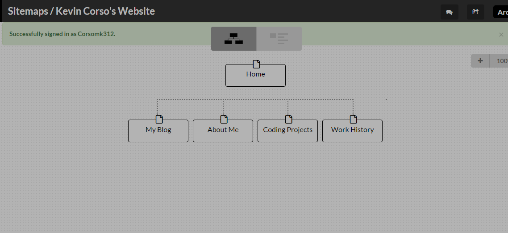

## What are the six phases of Web Design?

The six phases are Information Gathering, Planning, Design, Development, Testing & delivery and Maintenance.

##What is your site's primary goal or purpose? What kind of content will your site feature?

My site's main goal and purpose is to build a personal brand and to showcase the work that I have done and create a place where someone (i.e a future employer) would be able to get a sense of who I am from the things I have on my website. My site will feature content about me and things I have done and things I enjoy.

##What is the primary "action" the user should take when coming to your site? Do you want them to search for information, contact you, or see your portfolio? It's ok to have several actions at once, or different actions for different kinds of visitors.

Well for me the ideal user would be potential employers, and in the future possibly potential clients. I would like them to be able to readily see information, not have them search out for it. I would want my portfolio to be easily accessible for the user to find. I would also want my contact information to be easily accessible as well. I think that aiming for employers I would want to have all three of these features, but the primary would have to be the ability to contact me. 

##What are the main things someone should know about design and user experience?

I think one of the most important things to know is that every situation is unique. There will be no cookie cutter solutions to designing a website, or the UX that delivers to the end user. Each site is unique to the individual or company that wants it, and it will present it's own set of problems. Sure, syntaxially (sp?) there will be similarities, but in terms of what you're looking to provide it will be your problem to creatively solve. 

##What is user experience design and why is it valuable? 

UX design is the design of the front-end of the website. In other words it is the portion of the website that the user sees. So user experience design is the process of creating the front end of the website. It is important because it is the face of your website. It is what your users will be seeing and interacting with, and if it is visually unappealing, or not easy to use, then you might end up losing visitors/customers simply because of poor design. 

##Which parts of the challenge did you find tedious?
As this is my first time doing anything with website design, I didn't find anything to be particularly tedious..