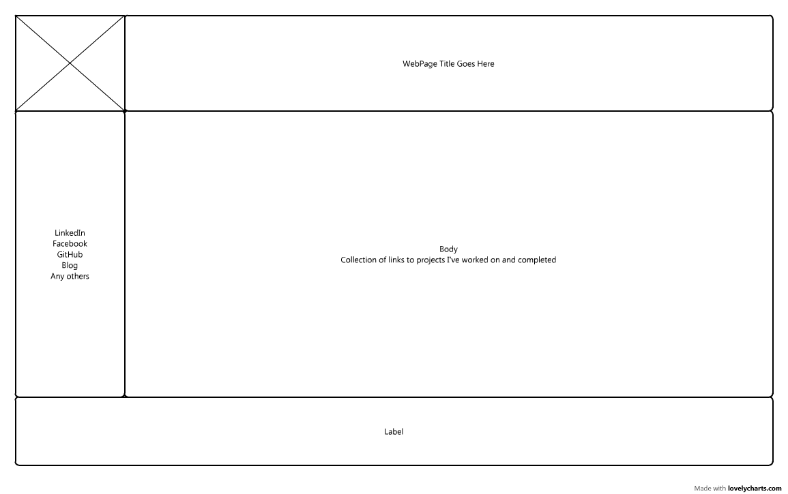
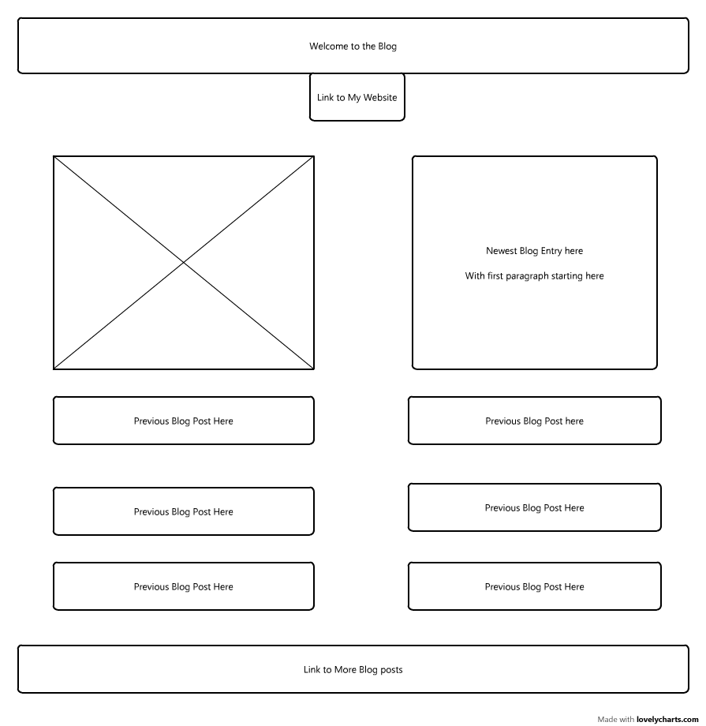

##What is a wireframe?

A Wireframe is the 1st step in designing a website. It is essentially the blueprint drawing of your webpage. It's the basic layout of what you're designing. The wireframe can be changed and you don't have to go with your first idea, but it is there to give you an idea of how you will set the site up.

##What are the benefits of wireframing?

The benefits of wireframing are that it allows you to organize yourself before you get started into the more nuanced parts of the design process. I feel like once you have the basic idea, you can then build into more creative designs from the basic framework you have put down. 

##Did you enjoy wireframing your site?

Well, I have never been one to have an eye for creating creative aesthetics, so this was a challenge for me. I did enjoy playing around with a couple of different designs, and it was definitely a good experience. I would say I enjoyed it, and I am looking forward to getting more experience and strengthening one of my known weaknesses.

##Did you revise your wireframe or stick with your first idea?

I think I revised within each part, so once I was finished I stuck with that design. While I didn't change the final product, I played around with changing different blocks in different positions while I was going through, so I didn't revise my wireframe once it was completed, but I definitely spent a lot of time revising the parts while I was in it.

##What questions did you ask during this challenge? What resources did you find to help you answer them?

I think the main question was what does a good wireframe look like? I have never done anything with it before, so I was interested to see what worked for other people. I went to a couple of different websites that had lists of "Beautiful/organized" wireframes to get an idea. I still think I will need to expose myself to more examples, and also work through the rest of the process before I get a full understanding and appreciation for wireframing.

##Which parts of the challenge did you enjoy and which parts did you find tedious?
I enjoyed learning about the wireframing process, and where it eventually ends up. I thought the process of lining everything up on the grid to be in the same spot, and ensuring that everything was the right size and the spacing looked good was tedious. I'm still not sure I am happy with the result, but I set my timer as to not fall down that rabbit hole so I will revisit it as I learn more about it.